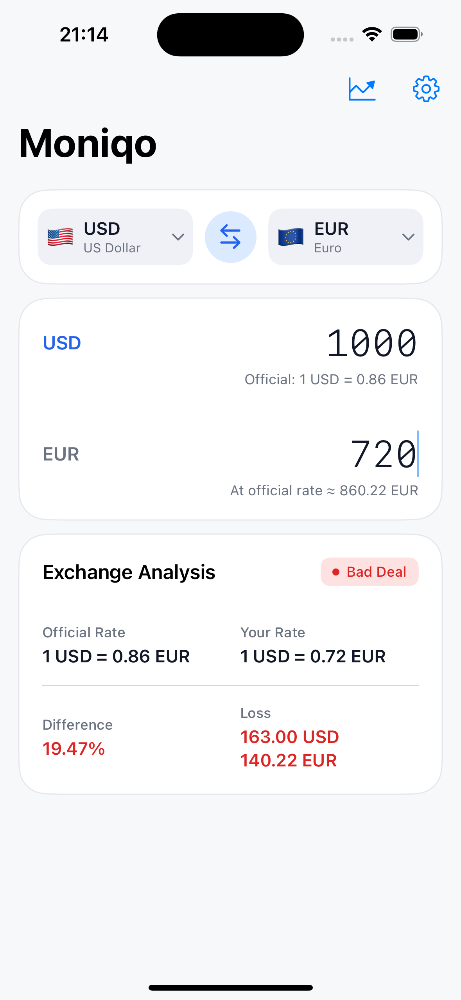
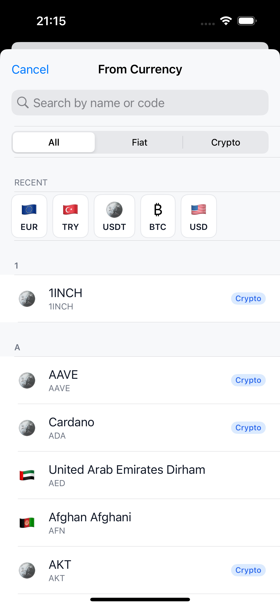
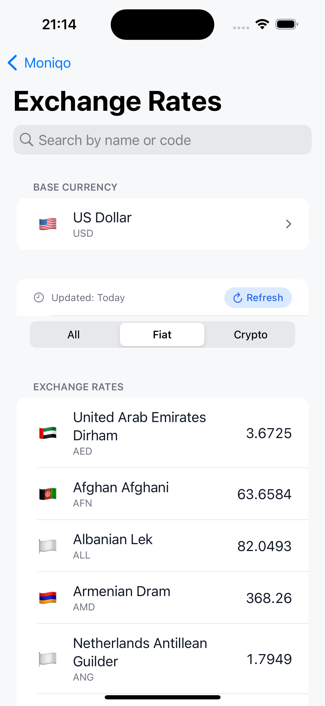
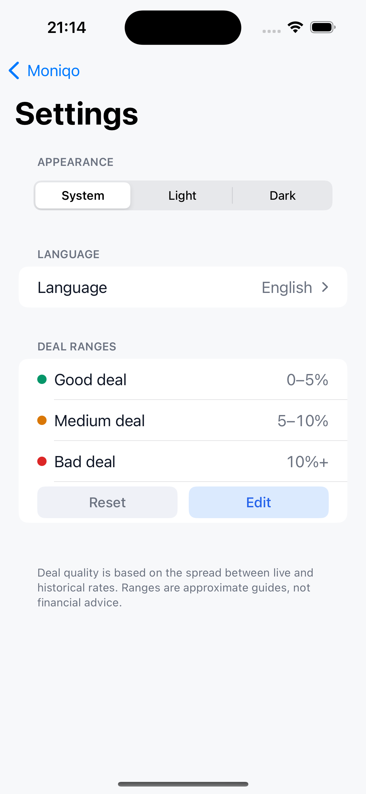
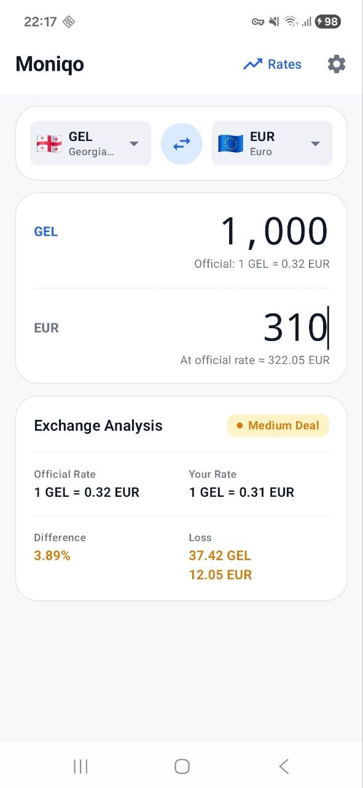
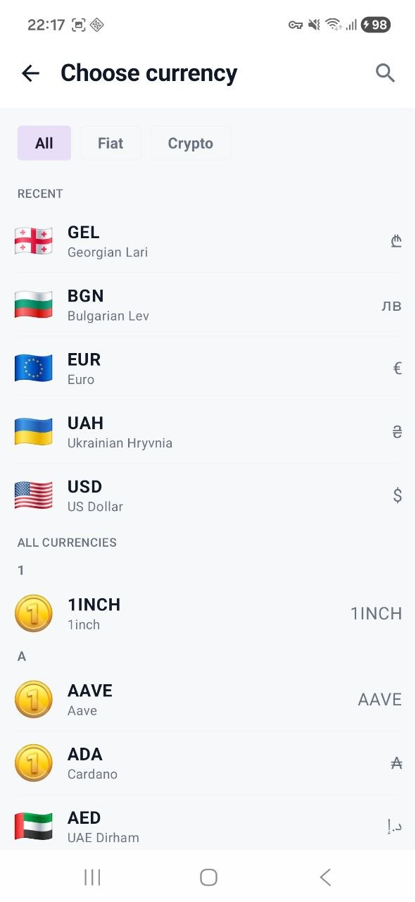
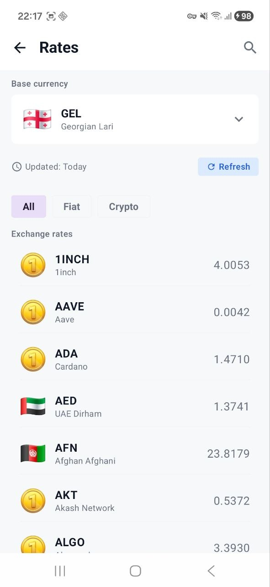
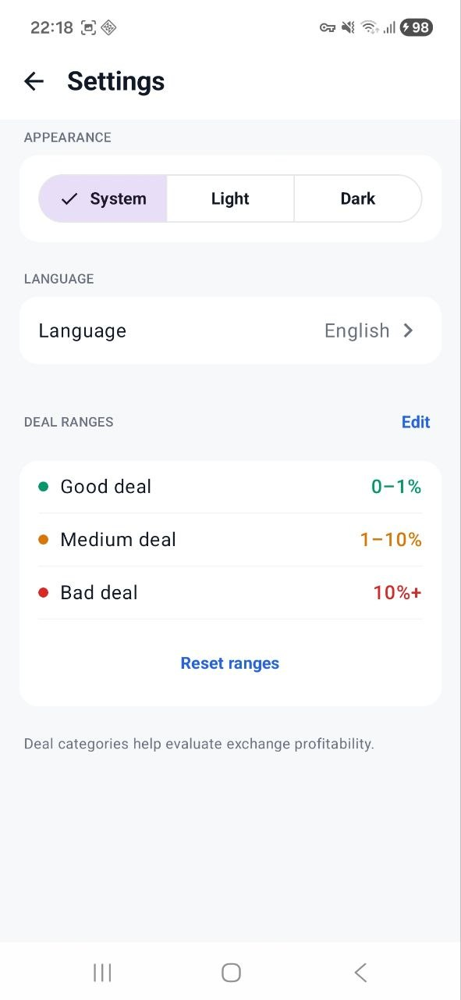

<h1 align="center">
  
  <br>
  Moniqo
  <br>
</h1>

<p align="center">
  A modern currency exchange tracker built with <strong>Kotlin Multiplatform</strong>,<br>
  sharing business logic across Android and iOS while keeping native UIs.
</p>

---

## Features

- **Live exchange rates** — fetch and display up-to-date currency rates
- **Currency pair tracking** — pin a FROM/TO pair and watch it update in real time
- **Deal quality analysis** — colour-coded badges (Good / Average / Poor) with configurable thresholds
- **Multi-currency rates table** — browse all rates with a switchable base currency
- **Smart currency picker** — searchable list with recent-currencies shortcut
- **Appearance settings** — Light, Dark, or System theme
- **Language settings** — switch app language without restarting
- **Offline-first** — rates cached locally via SQLDelight; app opens instantly
- **100% native UIs** — Jetpack Compose on Android, SwiftUI on iOS

---

## Screenshots

### iOS

<p>
  
  
  
  
</p>

### Android

<p>
  
  
  
  
</p>

---

## Architecture

Moniqo follows **Clean Architecture** with a strict unidirectional data flow (MVI) on both platforms.

```
┌─────────────────────────────────────────────────────────┐
│                    Kotlin Multiplatform                  │
│                                                         │
│  ┌──────────────┐  ┌───────────────┐  ┌─────────────┐  │
│  │  :shared:    │  │  :shared:     │  │  :shared:   │  │
│  │   core       │  │   network     │  │   storage   │  │
│  │              │  │               │  │             │  │
│  │  Models      │  │  Ktor client  │  │  SQLDelight │  │
│  │  UseCases    │  │  DTOs         │  │  Migrations │  │
│  │  Repos       │  │  Mappers      │  │  Drivers    │  │
│  └──────────────┘  └───────────────┘  └─────────────┘  │
└─────────────────────────────────────────────────────────┘
          │                                    │
          ▼                                    ▼
┌──────────────────────┐          ┌────────────────────────┐
│     Android UI       │          │        iOS UI          │
│  (Jetpack Compose)   │          │       (SwiftUI)        │
│                      │          │                        │
│  :android-ui:home    │          │  HomeScreen.swift      │
│  :android-ui:rates   │          │  HomeViewModel.swift   │
│  :android-ui:        │          │  HomeMapper.swift      │
│    choose-currency   │          │  HomeContainer.swift   │
│  :android-ui:        │          │                        │
│    settings          │          │                        │
└──────────────────────┘          └────────────────────────┘
```

### Module graph

| Module | Responsibility |
|---|---|
| `:shared:core` | Domain models, repository interfaces, use cases, Koin module |
| `:shared:network` | Ktor-based remote data source and repository implementations |
| `:shared:storage` | SQLDelight local persistence with `expect/actual` DB drivers |
| `:shared:test` | All unit tests, named mocks, model fixtures (JVM target only) |
| `:android-ui:core` | Compose theme, navigation routes, shared components, app-level state holders |
| `:android-ui:home` | Home screen — MVI state, ViewModel, mapper, components |
| `:android-ui:rates` | Rates table screen with dynamic base-currency switching |
| `:android-ui:choose-currency` | Searchable currency picker with recent-currencies support |
| `:android-ui:settings` | Appearance, language, and deal-range configuration screen |
| `:androidApp` | Android entry point, Koin initialisation, navigation host |

---

## Tech Stack

| Layer | Technology |
|---|---|
| Language | Kotlin 2.3.21 |
| Multiplatform | Kotlin Multiplatform |
| Android UI | Jetpack Compose + Compose Multiplatform 1.10.3 |
| iOS UI | SwiftUI |
| Networking | Ktor 3.1.3 |
| Local DB | SQLDelight 2.0.2 |
| DI | Koin 4.0.3 |
| Async | Kotlin Coroutines + Flow 1.10.2 |
| Serialization | kotlinx.serialization 1.8.1 |
| Navigation (Android) | Navigation3 1.1.1 |
| Linting | ktlint 12.1.1 |
| Min SDK | Android 28 / iOS 16+ |

---

## Getting Started

### Prerequisites

- **Android Studio** Meerkat or later (with KMP plugin)
- **Xcode 16+**
- **JDK 17**

### Clone

```bash
git clone https://github.com/viacheslav-chugunov/Moniqo.git
cd Moniqo
```

### Android

Run directly from Android Studio, or from the terminal:

```bash
./gradlew :androidApp:assembleDebug
```

Install on a connected device or emulator:

```bash
./gradlew :androidApp:installDebug
```

### iOS

Build the shared framework first:

```bash
./gradlew :shared:embedAndSignAppleFrameworkForXcode
```

Then open `iosApp/iosApp.xcodeproj` in Xcode and run on a simulator or device.

> The Xcode build phase already calls the Gradle task above automatically, so for day-to-day development just press **Run** in Xcode.

---

## Running Tests

All unit tests live in `:shared:test` and run on the JVM target:

```bash
./gradlew :shared:test:jvmTest
```

---

## Code Style

The project enforces **ktlint** across all subprojects. Run the formatter before committing:

```bash
# Check
./gradlew ktlintCheck

# Auto-fix
./gradlew ktlintFormat
```

---

## Project Structure

```
Moniqo/
├── build-logic/              # Convention plugins (kmp-shared-library)
├── shared/
│   ├── core/                 # Domain layer
│   ├── network/              # Remote data layer
│   ├── storage/              # Local data layer
│   └── test/                 # Shared unit tests
├── android-ui/
│   ├── core/                 # Theme, navigation, shared components
│   ├── home/                 # Home feature
│   ├── rates/                # Rates feature
│   ├── choose-currency/      # Currency picker feature
│   └── settings/             # Settings feature
├── androidApp/               # Android application entry point
└── iosApp/                   # iOS application (SwiftUI)
    └── iosApp/
        ├── core/             # Extensions, theme, navigation
        ├── home/             # Home feature (model/screen/components/di)
        └── ...
```

---

## Contributing

Contributions are welcome! Here's how to get started:

1. **Fork** the repository
2. **Create** a feature branch: `git checkout -b feature/your-feature`
3. **Follow** the module conventions — new features go in their own `:android-ui:<feature>` module and mirror the `model/screen/components/di` structure on iOS
4. **Add tests** in `:shared:test` using named `XxxMock` classes
5. **Run** `./gradlew ktlintFormat :shared:test:jvmTest` before pushing
6. **Open** a pull request with a clear description of what changes and why

---

## License

```
MIT License

Copyright (c) 2026 Viacheslav Chugunov

Permission is hereby granted, free of charge, to any person obtaining a copy
of this software and associated documentation files (the "Software"), to deal
in the Software without restriction, including without limitation the rights
to use, copy, modify, merge, publish, distribute, sublicense, and/or sell
copies of the Software, and to permit persons to whom the Software is
furnished to do so, subject to the following conditions:

The above copyright notice and this permission notice shall be included in all
copies or substantial portions of the Software.

THE SOFTWARE IS PROVIDED "AS IS", WITHOUT WARRANTY OF ANY KIND, EXPRESS OR
IMPLIED, INCLUDING BUT NOT LIMITED TO THE WARRANTIES OF MERCHANTABILITY,
FITNESS FOR A PARTICULAR PURPOSE AND NONINFRINGEMENT. IN NO EVENT SHALL THE
AUTHORS OR COPYRIGHT HOLDERS BE LIABLE FOR ANY CLAIM, DAMAGES OR OTHER
LIABILITY, WHETHER IN AN ACTION OF CONTRACT, TORT OR OTHERWISE, ARISING FROM,
OUT OF OR IN CONNECTION WITH THE SOFTWARE OR THE USE OR OTHER DEALINGS IN THE
SOFTWARE.
```
